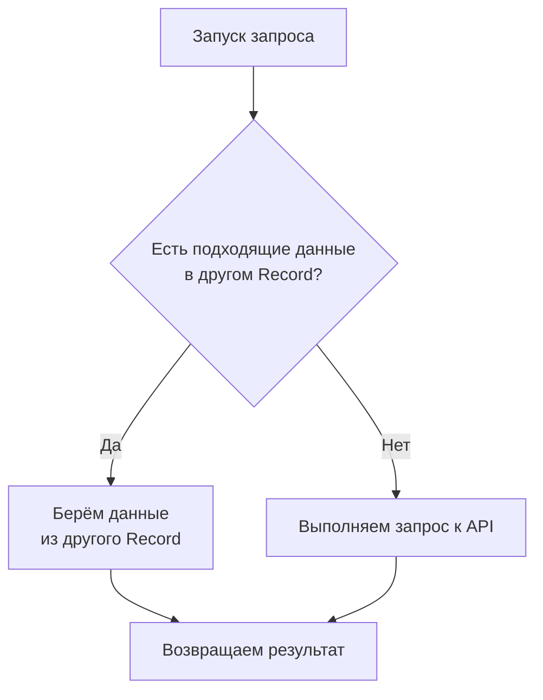

# Record (Запросы API) / Взаимствование

_Особенности_: <Badge type="tip" text="Не поддерживает SSR" />

В **Nuxoblivius** предусмотрен механизм оптимизации запросов — взаимствование данных (_borrowing_).
Он позволяет сократить количество обращений к **API**, повторно используя уже загруженные данные из других запросов.

:::tip Почему это может пригодиться?
Например, если у вас есть _список новостей_, и вы хотите получить конкретную новость по _ID_, фреймворк сначала попробует взять её из уже загруженного списка. Если данные найдены — новый запрос не выполняется.
:::

**Алгоритм работы (_Mermaid_)**:



## Как использовать взаимствование между Record?

Чтобы включить механизм взаимствования, используется метод `.borrowFrom()`.
Он позволяет задать условие, при котором текущий запрос будет пытаться взять данные у другого **Record**, вместо того чтобы выполнять новый запрос.

---

**Метод принимает три аргумента**:

1. `Условие включения` — когда именно нужно пытаться использовать взаимствование.
2. `Функция получения данных` — получает данные из другого запроса.
3. `Функция проверка` — возвращает найденные подходящие данные (если не нашли возвращаем _null_).

```ts {6-11}
import { Record } from "nuxoblivius";

const getAllPosts = Record.new("/api/posts", []);
const getPostById = Record.new("/api/posts/{id}", {});

getPostById.borrowFrom(
  ({ path, query }) => true, // Всегда искать
  () => getAllPosts.response, // Получаем данные о всех постах
  (allPostItem, { path, query }) =>
    allPostItem.id == path.id ? allPostItem : null, // Ищем по id
);
```

:::tip В итоге
Если подходящие данные будут найдены — **Record** вернёт их, и запрос к **API** не выполнится. Иначе — выполнится стандартный запрос.
:::

---

**Детальный разбор**:

1. `Условие включение`:

   > Первый аргумент метода `.borrowFrom()` отвечает за то, когда именно включать взаимствование.
   > Это функция, которая получает объект с параметрами текущего запроса:
   >
   > ```ts
   > ({ path, query }) => true;
   > ```
   >
   > - `path` — объект с текущими _path_-параметрахпараметрами;
   > - `query` — объект с текущими _query_-параметрами.
   >
   > Функция должна вернуть `true` или `false`.
   > Таким образом, вы можете гибко контролировать ситуации, когда взаимствование полезно, а когда его лучше отключить.
   >
   > В данном примере, взаимствование будет всегда отрабатывать

2. `Функция получения данных`:

   > Второй аргумент метода `.borrowFrom()`, указывает откуда нужно взять данные которые мы будем взаимствовать
   >
   > ```ts
   > () => getAllPosts.response;
   > ```
   >
   > Мы не ограниченны использованием **Record**, можно использовать любой источник данных.
   >
   > В данном примере, мы берём данные у **getAllPosts**

3. `Функция проверка`:

   > Третий аргумент метода `.borrowFrom()` отвечает за поиск подходящих данных среди уже загруженных.
   > Если функция находит совпадение — оно возвращается и запрос к **API** не выполняется.
   > Если совпадения нет — выполняется обычный запрос.
   >
   > **Функция получает два аргумента**:
   >
   > - `item` — элемент массива (например, _объект поста_).
   > - `Контекст запроса` — объект с `path` и `query` параметрами, которые можно использовать для проверки.
   >
   > **Пример**:
   >
   > ```ts
   > (postItem, { path, query }) => {
   >   if (postItem.id == path.id) {
   >     return postItem;
   >   }
   > };
   > ```
   >
   > В этом случае, если _id_ поста из массива совпадает с _id_ в path-параметрах — возвращается найденный объект. Иначе запрос продолжит выполнение как обычно.

## Особенности взаимствования

Механизм взаимствования в **Nuxoblivius** можно гибко настраивать.

#### 1. Управление очисткой `response`.

> Вы можете выбрать, когда именно очищать данные:
>
> - `greedy` Сразу при запуске запроса — response очищается до попытки взаимствования.
> - `lazy` Только если взаимствование не сработало — данные сохраняются, пока не станет ясно, что запрос всё же нужно отправлять.
>
> см. также [swapMethod](/release/record/advanced.html#регулирование-отчистки-данных-во-время-запроса)

#### 2. Взаимствование как кэширование

> Если вам нужна собственная система кэширования, взаимствование может использоваться как её основа. Вы можете сохранять результаты предыдущих запросов и подменять ими новые.

#### 3. Цепочка взаимствований

> Каждый вызов `.borrowFrom()` добавляет обработчик в стек. Это значит, что можно настроить несколько источников данных для взаимствования, и они будут проверяться последовательно, пока один из них не вернёт результат.

## Синтаксический сахар

У метода `.borrowFrom()`, в параметре [Условие включения](#как-использовать-взаимствование-между-record), доступен упрощённый синтаксис.
Вместо написания длинных функций можно использовать объект с короткими проверками:

> - `*` — данные существуют (эквивалент !== null).
> - `null` — данные не установлены (эквивалент === null).
> - `Любое значение` — данные равны этому значению (эквивалент == <значение>).

```ts {7}
import { Record } from "nuxoblivius";

const getAllPosts = Record.new("/api/posts", []);
const getPostById = Record.new("/api/posts/{id}", {});

// Пусть взаимствование, работает только когда path-параметр `id` не равен null
getPostById.borrowFrom(
  ({ path, query }) => path.id !== null, // [!code --]
  { id: "*" }, // [!code ++]
  ...
);
```
